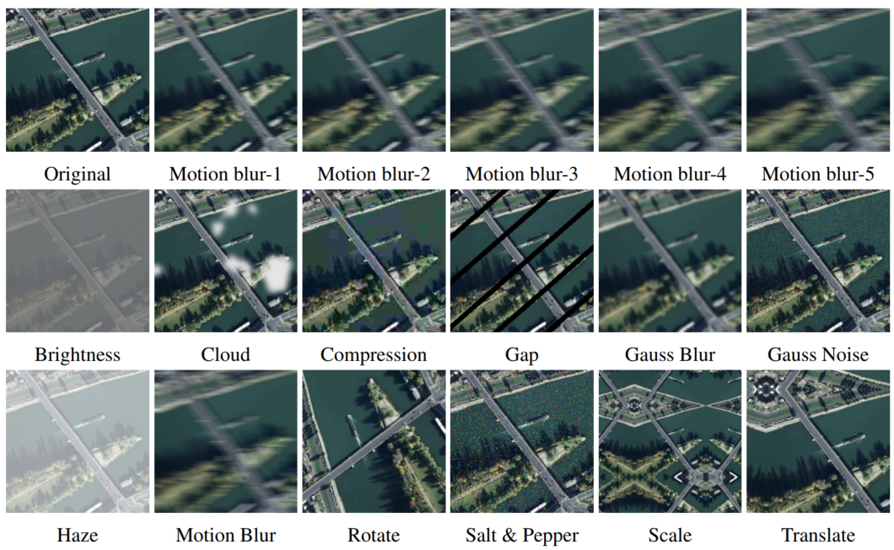

# REOBench
<font size='5'>**REOBench: Benchmarking Robustness of Earth Observation Foundation Models**</font>

Xiang Li, Yong Tao, Siyuan Zhang, Siwei Liu, Zhitong Xiong, Chunbo Luo, Lu Liu, Mykola Pechenizkiy, Xiao Xiang Zhu, Tianjin Huang

<a href='https://github.com/lx709/REOBench'></a> <a href='https://arxiv.org/pdf/2505.16793'></a>  <a href='https://huggingface.co/datasets/xiang709/REOBench'>


# REOBench

<center>
    
</center>

We introduce REOBench, a comprehensive Benchmark designed to evaluate the Robustness of Earth Observation Foundation Models. Our benchmark systematically evaluates the robustness of extensive prevalent foundation models, covering state-of-the-art models based on masked image modeling, contrastive learning, and large language models. REOBench focuses on high-resolution optical remote sensing images, which are widely used in real-world applications such as urban planning and disaster response. We conducted experiments on six widely studied remote sensing image understanding tasks, covering both vision-centric and vision-language tasks, under twelve types of perturbations. These include both appearance-based corruptions (e.g., noise, blur, haze) and geometric distortions (e.g., rotation, scale, translation), applied at varying severity levels to simulate realistic environmental and sensor-induced challenges. 


## 🗓️ TODO
- [x] **[2025.05.15]** We release the REOBench, a Benchmark for Evaluating the Robustness of Earth Observation Foundation Models.

## Using `datasets`

The dataset can be downloaded from [link](https://huggingface.co/datasets/xiang709/REOBench) and used via the Hugging Face `datasets` library. To load the dataset, you can use the following code snippet:

```python
from datasets import load_dataset
fw = load_dataset("xiang709/REOBench", streaming=True)
```

## Segmentation
We use mmsegmentation for semantic segmeantation experiments. Please check ```Segmenation``` folder for details.

## Detection
We use mmrorate for object detection experiments. Please check ```Detection``` folder for details.

## Classification
Please check ```Classification``` folder for details.

## Caption, VQA, Visual Grounding
We provide evaluation code for evaluating vision-langauge models. Check ```VRSBench``` folder for details. Codes are adapted from [VRSBench](https://github.com/lx709/VRSBench).

## Licensing Information
The dataset is released under the [CC-BY-4.0]([https://creativecommons.org/licenses/by-nc/4.0/deed.en](https://creativecommons.org/licenses/by/4.0/deed.en)), which permits unrestricted use, distribution, and reproduction in any medium, provided the original work is properly cited.

## Related Projects
- [VRSBench](https://github.com/lx709/VRSBench). A Versatile Vision-Language Benchmark Dataset for Remote Sensing Image Understanding.
- [CLAIR](https://github.com/DavidMChan/clair). Automatic GPT-based caption evaluation.

## 📜 Citation

```bibtex
@misc{li2025reobenchbenchmarkingrobustnessearth,
      title={REOBench: Benchmarking Robustness of Earth Observation Foundation Models}, 
      author={Xiang Li and Yong Tao and Siyuan Zhang and Siwei Liu and Zhitong Xiong and Chunbo Luo and Lu Liu and Mykola Pechenizkiy and Xiao Xiang Zhu and Tianjin Huang},
      year={2025},
      eprint={2505.16793},
      archivePrefix={arXiv},
      primaryClass={cs.CV},
      url={https://arxiv.org/abs/2505.16793}, 
}
```

## 🙏 Acknowledgement
Our REOBench dataset is built based on [AID](https://captain-whu.github.io/DOTA/dataset.html), [DIOR](https://gcheng-nwpu.github.io/#Datasets), and [VRSBench](https://github.com/lx709/VRSBench) datasets.

We use [mmdetection](https://github.com/open-mmlab/mmdetection) and [mmsegmentation](https://github.com/open-mmlab/mmsegmentation) for in our experiments.

