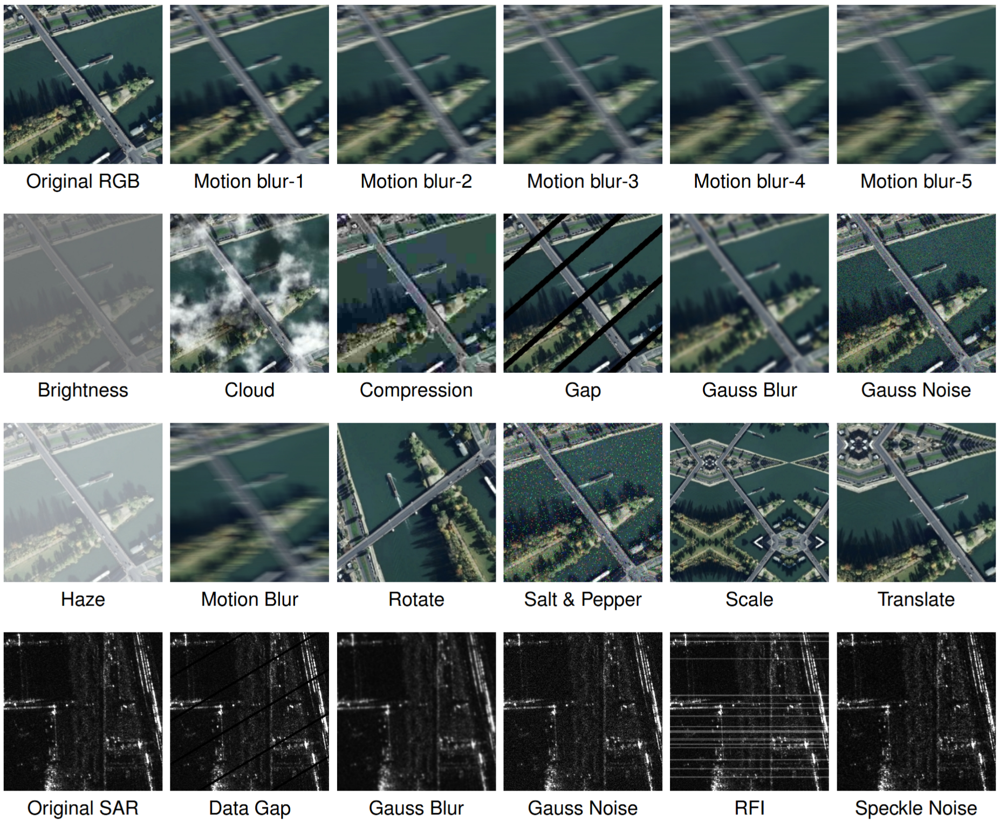

# REOBench
<font size='5'>**REOBench++: Benchmarking Robustness of Earth Observation Foundation Models**</font>

Yong Tao, Xiang Li, Gaojie Jin, Carla Di Cairano-Gilfedder, Rui Yang, Siwei Liu, Zhitong Xiong, Chunbo Luo, Lu Liu, Mykola Pechenizkiy, Xiao Xiang Zhu, Tianjin Huang

<a href='https://github.com/lx709/REOBench/tree/REOBench_pp'></a> <a href='https://arxiv.org/pdf/2505.16793'></a> <a href='https://arxiv.org/pdf/2505.16793'></a> <a href='https://huggingface.co/datasets/xiang709/REOBench'></a>


# REOBench++

<center>
    
</center>

We introduce **REOBench++**, a comprehensive Benchmark designed to evaluate the **R**obustness of **E**arth **O**bservation foundation models.**REOBench++** substantially extends our previous benchmark, **REOBench**, which focused exclusively on the RGB modality, by broadening the evaluation to the three most widely used remote sensing image modalities—**RGB, MS and SAR** imagery. The benchmark evaluates state-of-the-art foundation models spanning masked image modeling, contrastive learning, and multimodal large language models. We conduct experiments on **six** extensively studied remote sensing image understanding tasks, covering both vision-centric and vision-language settings, under **fourteen** types of perturbations. These perturbations include appearance-based corruptions (e.g., noise, blur, haze), geometric distortions (e.g., rotation, scale, translation), and modality-specific perturbations tailored to the distinctive characteristics of each sensor type, applied at varying severity levels to simulate realistic environmental and sensor-induced challenges.


## 🗓️ News
- **[2026.06.05]** 🚀 **REOBench++** Released. Extended from REOBench with new MS datasets (BigEarthNet, DFC2020) and SAR datasets (SARDet-100K, VRSBench-SAR). [[paper](https://)] [[code](https://github.com/lx709/REOBench/tree/REOBench_pp)]
- **[2024-09-18]**: REOBench is accepted to NIPS 2025! [[paper](https://arxiv.org/pdf/2505.16793)] [[code](https://github.com/lx709/REOBench/tree/main)]
- **[2025.05.15]** We release the REOBench, a Benchmark for Evaluating the Robustness of Earth Observation Foundation Models.

## Using `datasets`

The dataset can be downloaded from [link](https://huggingface.co/datasets/xiang709/REOBench) and used via the Hugging Face `datasets` library. To load the dataset, you can use the following code snippet:

```python
from datasets import load_dataset
fw = load_dataset("xiang709/REOBench", streaming=True)
```

## Classification
We use a linear probe for RGB_classification and mmpretrain for MS_Classification. Please check ```RGB_Classification```  and ```MS_Classification``` folder for details.

## Segmentation
We use mmsegmentation for semantic segmeantation experiments. Please check ```RGB_Segmenation``` and ```MS_Segmenation``` folder for details.

## Detection
We use mmrotate for object detection experiments. Please check ```RGB_Detection``` and ```SAR_Detection``` folder for details.

## Caption, VQA, Visual Grounding
We provide evaluation code for evaluating vision-langauge models. Check ```VRSBench``` folder for details. Codes are adapted from [VRSBench](https://github.com/lx709/VRSBench).

## Licensing Information
The dataset is released under the [CC-BY-4.0]([https://creativecommons.org/licenses/by-nc/4.0/deed.en](https://creativecommons.org/licenses/by/4.0/deed.en)), which permits unrestricted use, distribution, and reproduction in any medium, provided the original work is properly cited.

## Related Projects
- [VRSBench](https://github.com/lx709/VRSBench). A Versatile Vision-Language Benchmark Dataset for Remote Sensing Image Understanding.
- [CLAIR](https://github.com/DavidMChan/clair). Automatic GPT-based caption evaluation.

## 📜 Citation

```bibtex
@misc{li2025reobenchbenchmarkingrobustnessearth,
      title={REOBench: Benchmarking Robustness of Earth Observation Foundation Models}, 
      author={Xiang Li and Yong Tao and Siyuan Zhang and Siwei Liu and Zhitong Xiong and Chunbo Luo and Lu Liu and Mykola Pechenizkiy and Xiao Xiang Zhu and Tianjin Huang},
      year={2025},
      eprint={2505.16793},
      archivePrefix={arXiv},
      primaryClass={cs.CV},
      url={https://arxiv.org/abs/2505.16793}, 
}
```

## 🙏 Acknowledgement
Our REOBench dataset is built based on [AID](https://captain-whu.github.io/DOTA/dataset.html), [BigEarthNet](https://bigearth.net/v1.0.html), [ISPRS Potsdam](https://www.isprs.org/resources/datasets/benchmarks/UrbanSemLab/2d-sem-label-potsdam.aspx?utm_source=chatgpt.com), [DIOR](https://gcheng-nwpu.github.io/#Datasets), [SARDet-100K](https://github.com/zcablii/sardet_100k), and [VRSBench](https://github.com/lx709/VRSBench) datasets.

We use [mmpretrain](https://github.com/open-mmlab/mmpretrain), [mmdetection](https://github.com/open-mmlab/mmdetection) and [mmsegmentation](https://github.com/open-mmlab/mmsegmentation) for in our experiments.

